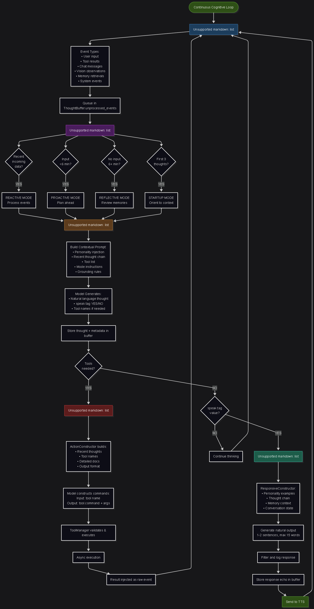
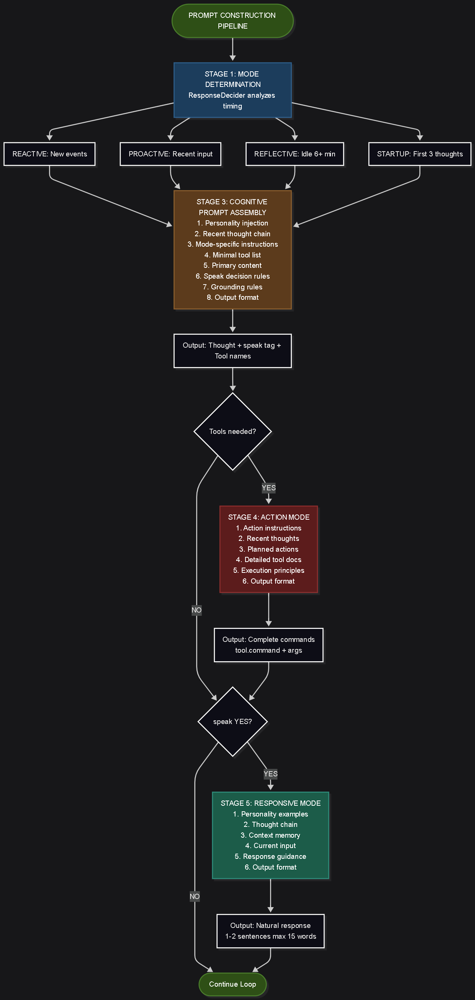
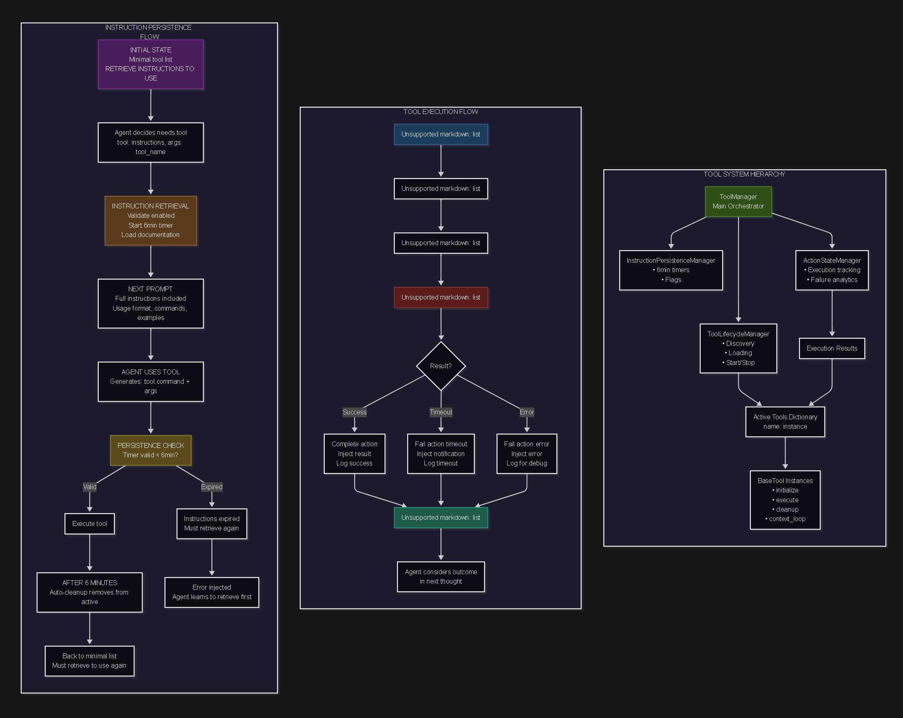
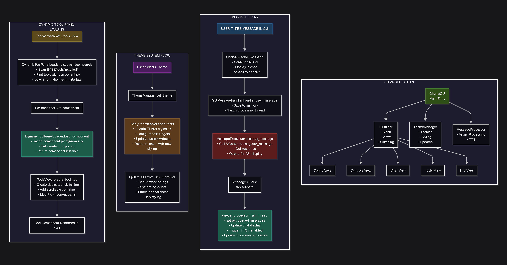

# Agentic AI System Architecture

## Overview
This is a sophisticated agentic AI system built on Ollama that implements a two-stage cognitive architecture separating internal thinking from external communication. The agent maintains continuous autonomous thought, manages multiple memory tiers, executes tools dynamically, and generates natural spoken responses when it decides to speak. 

**Features of this agentic system:**
- Completely and easily customizable personality
- Persistent memory similar to a human's that can recall a day's events even after years have passed.
- Agent's cognition runs continuously, with or without input and decides when to speak
- Interact with either text or voice
- Modular tools can be added or removed without modifying the agent, simply drop the new tool directory in or remove an existing one
- Flexible architecture can run on many types of devices and hardware configurations with little modification (mobile version runs on smartphone/tablet)
- Memory can persist between devices using a private GitHub repo to sync agent memory
- Content filters replace profanity or undesired words with [FILTERED], but do not block the rest of the content
- Universal kill command key phrase (immediately shuts down entire system when it finds this phrase in ANY source of incoming data)
- Uncensored agent when using an uncensored LLM for the spoken response mode (still retains all functionality, only affects spoken responses); recommended: llama2-uncensored:7b-chat-q4_K_M

**Example of use:**
The agent's avatar lives in the corner of the screen while the user is gaming, coding, or doing other tasks. When left alone, the agent may occasionally speak to see if anyone is listening or run background tasks like researching topics related to interactions with the user. When engaged, the agent observes what is happening on the screen and uses any available tool results to form thoughts and responses to the users. When tools are installed and enabled (internet search, file uploads, coding tool, reminders, calendar, etc.) the agent automatically uses these however and whenever it decides to. The user has complete control over these features and may toggle individual tools, agent voice, voice input, background processing, memory retention, and content filters at any time. The user may toggle these features, modify agent prompts, limit the agent's processing speed, adjust the agent's voice volume, and edit the system files all while the agent runs without having to restart the agent and the system updates automatically.

**Important note:** This agent learns and becomes better over time as it retains memories of interactions with the user. On first uses, the agent will have all functionality, but its true use and behavior emerges after a while interacting with the user; recalling relationships, important events, and others it has interacted with over time and setting reminders and making plans for the future.

**This system was created by @KryptykBioz**

**Anna_AI was created as an open-source, free-to-use agentic system for personal use only.**

**Other projects and information can be found here:**
- Github: [KryptykBioz](https://github.com/KryptykBioz)
- YouTube: [@KryptykBioz](https://www.youtube.com/@KryptykBioz)
- Twitch: [Kryptykbioz](https://www.twitch.tv/kryptykbioz)

**This framework was created in my free time without formal training (current college student). As I am self-taught when it comes to AI, self-funded, and created this for the public, any contribution to my work is greatly appreciated (and much needed!). Consider making a small donation, subscribing to my channels, or liking some of my videos to keep me going as I continue creating these kinds of agents for others to use. Thank you!**

---

## Table of Contents

### Usage Notes
1. [General Instructions](#usage-guide)

### Core Systems
2. [Core Processing Architecture](#core-processing-architecture)
3. [Modular Prompting System](#modular-prompting-system)
4. [Memory System](#memory-system)
5. [Tool Handler System](#tool-handler-system)
6. [Graphical User Interface System](#graphical-user-interface-system)

### Supporting Systems
7. [Session Management](#session-management)
8. [Chat Engagement System](#chat-engagement-system)
9. [Configuration System](#configuration-system)
10. [Content Filtering](#content-filtering)
11. [Logging System](#logging-system)

### System Overview
12. [Data Flow Summary](#data-flow-summary)
13. [Key Design Principles](#key-design-principles-1)
14. [Integration Points](#integration-points)

---

# Usage Notes

- **Starting the Agent**: Read the SETUP.md file in the project root for installation and setup instructions
- **Tools**: All optional tools for this agent are stored in a separate repository and may be downloaded from https://github.com/KryptykBioz/AI_Agent_Tools
- **Personalizing Your Agent**: Modify the personality and controls of your agent in the following files: bot_info.py, config.json, controls.py, personality_prompt_parts.py
- **Personalizing the system behavior**: If you are more familiar with prompting or would just like to experiment with your agent's behavior, the prompts are constructed of modular prompt parts stored in separate mode directories in the BASE/core directory. Each different mode of this system has its own _parts file and constructor, so modes may be modified without affecting the others.
- **Updating**: As the agent is personalized exclusively in the personality/ directory and this is where all of your agents memories are stored, simply replace the BASE/ directory when updating to newer released versions. The personality/ directory of the project is only modified when absolutely necessary to avoid breaking changes. When updates are made to the project's personality/ directory, either compare to the old and transfer the changes over or reimplement your old files back in. This ensures your agent's memories and configuration remain intact and are not overwritten.
- **Important!!!**: If you are unfamiliar with programming or Python in general, only modify the files in the Personality/ directory. Always remember to back up your files to be able to revert back easily!

---
# Core Processing Architecture

## Overview

This agentic framework implements a continuous cognitive processing system that operates independently of user input. The agent maintains an internal stream of consciousness, accumulates observations and thoughts, and decides when to generate verbal responses based on priority signals and accumulated context.

The architecture separates **thinking** (internal cognitive processing) from **speaking** (verbal output generation), enabling the agent to continuously process information while selectively engaging in conversation when appropriate.

## Key Design Principles

**Continuous Cognition**: The agent thinks constantly through an autonomous cognitive loop, processing events and forming thoughts regardless of user activity.

**Event-Driven Processing**: Raw incoming data (user messages, tool results, observations) are queued as events and transformed into interpreted thoughts through the thinking model.

**Priority-Based Response**: Thoughts are tagged with priority levels (LOW, MEDIUM, HIGH, CRITICAL) that determine urgency and influence when the agent should speak.

**Modular Prompts**: Different cognitive modes (reactive, responsive, proactive, reflective) use specialized prompt constructors optimized for their specific reasoning patterns.

**Separation of Concerns**: The system cleanly separates event capture, thought interpretation, priority assessment, prompt construction, and response generation into distinct components.

## Processing Flow

## Component Responsibilities

**CognitiveLoopManager** (`cognitive_loop_manager.py`):
- Orchestrates the continuous cognitive loop
- Detects pending events and triggers processing
- Manages loop timing and pacing
- Coordinates between components

**ResponseDecider** (`response_decider.py`):
- Determines which cognitive mode to use (REACTIVE/PROACTIVE/REFLECTIVE)
- Based purely on timing (new input vs. recent vs. idle)
- No content analysis or priority detection
- Returns PromptDecision with mode and context flags

**ThoughtProcessor** (`thought_processor.py`):
- Processes events through the appropriate cognitive mode
- Routes to mode-specific prompt constructors
- Extracts speak tags and tool names from cognitive output
- Delegates to ACTION mode if tools identified
- Stores processed thoughts with metadata

**ProcessingDelegator** (`processing_delegator.py`):
- Routes events to appropriate constructors
- Manages mode-specific processing pipelines
- Handles STARTUP, REACTIVE, PROACTIVE, and REFLECTIVE modes
- Coordinates with memory search for reflective modes

**ThoughtBuffer** (`thought_buffer.py`):
- Maintains thought history and conversation state
- Queues unprocessed events
- Provides context (user input, ongoing focus, goals)
- Tracks speak decisions from agent

**Prompt Constructors** (mode-specific):
- **ReactiveConstructor**: Processes new incoming events
- **ProactiveConstructor**: Plans ahead during quiet periods
- **ReflectiveConstructor**: Reviews memories during idle time
- **ActionConstructor**: Constructs complete tool commands with parameters
- **ResponsiveConstructor**: Generates verbal responses when agent decides to speak

**ToolManager** (`tool_manager.py`):
- Validates tool commands from ACTION mode
- Executes tools asynchronously
- Injects results back as events

**MemorySearch** (memory system):
- Retrieves relevant past experiences
- Provides personality-matched examples for responses
- Supports reflective thinking with memory context

## Adaptive Behavior

The system implements several adaptive mechanisms:

**Momentum Tracking**: Consecutive proactive thoughts build momentum, encouraging sustained reasoning on topics of interest.

**Context Decay**: Older thoughts naturally lose influence, preventing the agent from fixating on stale information.

**Priority Elevation**: Events can trigger immediate priority escalation (e.g., direct mentions force CRITICAL priority).

**Mode Switching**: The agent fluidly transitions between reactive, proactive, and reflective modes based on environmental context.

**Response Pacing**: Rate limiting prevents over-communication while allowing urgent responses through. Thinking continues unrestricted regardless of speaking frequency.

## Performance Characteristics

The cognitive loop operates at high frequency (10-20 cycles per second) during active periods, ensuring rapid response to new events. When idle, it adaptively slows to conserve resources while maintaining readiness. The separation of thinking and speaking allows the agent to maintain continuous cognitive activity (processing ~500-2000 thoughts per hour) while speaking selectively based on actual need rather than arbitrary timing.

This architecture enables natural, context-aware behavior that feels reactive to users while operating autonomously in the background, much like a human maintaining continuous awareness while choosing when to verbally engage.

---

# Modular Prompting System

## Overview

This agentic framework employs a sophisticated modular prompting architecture that adapts to different cognitive modes and communication needs. Instead of using a single monolithic prompt, the system dynamically constructs specialized prompts optimized for specific reasoning patterns: reactive processing of new events, reflective analysis of past experiences, forward-looking proactive, and natural responsive communication.

The prompting system separates **what to think about** (mode determination) from **how to think about it** (prompt construction), enabling the agent to maintain consistent personality while adapting its reasoning approach to the situation at hand.

## Design Philosophy

**Separation of Concerns**: Prompt construction is completely decoupled from decision logic. The ResponseDecider determines what type of thinking is needed, while specialized Constructors build the appropriate prompts.

**Reusable Components**: Prompt parts are modularized into reusable pieces (personality injection, grounding rules, output formats) that can be mixed and matched across different modes.

**Context-Aware Composition**: Each constructor intelligently selects and orders relevant context based on the reasoning mode, ensuring the LLM receives information in the most useful format.

**Persistent Instructions**: Tools can have their detailed instructions cached and selectively included in prompts only when relevant, avoiding prompt bloat while maintaining capability awareness.

**Personality Consistency**: A single unified personality definition is injected into all prompts, ensuring the agent maintains consistent character across different reasoning modes.

## Prompt Construction Flow

## Constructor Responsibilities

### ReactiveConstructor
**Purpose**: Process new incoming events through real-time cognitive processing

**Input Processing**:
- Raw event queue (user messages, tool results, observations)
- Recent thought chain for continuity
- Last user message for context
- Additional context parts (vision, chat, session files)

**Prompt Strategy**:
- Personality injection first (maintain character)
- Recent thoughts with source labels
- Mode instructions (process new events)
- Minimal tool list (names + 1-line descriptions only)
- Incoming events formatted with clear source tags
- Speak decision rules (agent controls when to respond)
- Grounding rules (hallucination prevention, especially for vision/tool state)

**Output Format**: Structured XML containing natural thought, speak decision tag, and optional actions array with tool invocations.

### ProactiveConstructor
**Purpose**: Plan ahead and set goals during quiet periods

**Context Building**:
- Current situation assessment
- Time context (minutes since user input)
- User activity status
- Minimal tool list (names only)

**Prompt Strategy**:
- Personality injection
- Recent thoughts for context
- Proactive mode instructions (anticipate, prepare, plan)
- Minimal tool list (no detailed docs)
- Time context and user status
- Speak decision rules
- Grounding rules (realistic planning based on context)

**Output Format**: Forward-looking thought with speak decision and optional tool actions.

### ReflectiveConstructor
**Purpose**: Review memories and find patterns during idle time

**Modes**:
- **Startup Mode**: First 3 thoughts use comprehensive initialization
- **Standard Mode**: Memory-triggered reflection on relevant past

**Startup Context Loading**:
1. Core identity knowledge from base memory
2. Personality examples from past behavior
3. Long-term memory summaries (recent days)
4. Yesterday's full conversation
5. Last session's message history

**Standard Context Loading**:
1. Current situation description
2. Relevant memories from query-based search
3. Temporal context (yesterday, earlier today)

**Prompt Strategy**:
- Personality injection
- Recent thoughts
- Reflective mode instructions (review, connect, find patterns)
- Retrieved memories (startup or query-based)
- Minimal tool list (names only)
- Speak decision rules
- Memory grounding (only reference provided memories)

**Output Format**: Reflective thought with speak decision and optional tool actions.

### ActionConstructor
**Purpose**: Construct complete tool commands with proper parameters using AI

**Critical Design**: ACTION mode is a **two-stage AI process** that transforms base tool names into complete executable commands:

**Stage 1 - Cognitive Mode**: Agent decides WHICH tools to use
- Input: User request or situation
- Output: Base tool names only in a simple JSON array
- Temperature: 0.6 (cognitive)

**Stage 2 - Action Mode**: AI constructs HOW to execute them
- Input: Base tool names + recent thoughts + detailed tool docs
- Output: Complete commands with full tool paths and arguments
- Temperature: 0.2 (precise)

**Why Two-Stage?**
1. **Separation of concerns**: Deciding vs. executing
2. **Context optimization**: Cognitive mode gets minimal tool list, action mode gets detailed docs only for selected tools
3. **Temperature optimization**: Creative thinking (0.6) vs. precise formatting (0.2)
4. **Prompt efficiency**: Tool documentation only loaded when needed

**Input Processing**:
- Recent thought chain (for parameter extraction)
- Planned tool names from cognitive mode
- Detailed tool documentation (dynamically retrieved)
- Action context (why these tools)

**Prompt Strategy**:
- Action mode instructions (construct complete commands)
- Recent thoughts (parameter context)
- Planned tool names (what to execute)
- DETAILED tool documentation (dynamically retrieved for specific tools only)
- Execution principles (command construction, parameter extraction)
- Output format rules (complete tool.command + args structure)

**Output Format**: XML actions tag containing JSON array of complete tool invocations with full paths and arguments.

**Complete Flow Example**:
1. **User**: "Play a happy sound"
2. **Cognitive Mode** (temp=0.6): Thinks about request, outputs base tool name "sound" with speak decision NO
3. **Action Constructor** builds prompt with recent thoughts, base tool name, and dynamically loaded sound tool documentation
4. **Action Mode AI** (temp=0.2): Reads docs, identifies sound.play command, extracts "happy" parameter from thoughts, constructs complete command
5. **Tool Manager**: Executes the complete tool command
6. **Result**: Injected back as event for cognitive mode

### ResponsiveConstructor
**Purpose**: Generate natural verbal responses when agent decides to speak

**Trigger**: Only activated when speak decision is YES in cognitive output

**Context Building**:
- Recent thought chain (what agent has been thinking)
- User input or chat messages to address
- Retrieved personality-matched examples
- Memory context if relevant
- Chat context if engaging with stream

**Example Retrieval Innovation**:
Unlike other constructors, ResponsiveConstructor uses a **combined query approach** for retrieving personality examples. It merges recent thoughts, user input, and chat context into a single query, ensuring examples match the full conversational situation rather than just the user's words in isolation. This finds responses that fit the agent's current mental context.

**Prompt Strategy**:
- Personality examples FIRST (retrieved from memory, primes style)
- Recent thought chain (internal context)
- Memory/session context (background)
- Current input (user message or chat)
- Response guidance (chat vs. standard, length constraints)
- Output format (natural text, no XML, max 15 words)

**Output Format**: Pure natural language text suitable for TTS, with no XML tags or structured data.

**Key Differences**:
- No XML tags in output
- No speak tags (already decided YES)
- No tool actions (those came from cognitive modes)
- Pure natural language for TTS

## Tool Instruction Persistence

The system implements **intelligent tool instruction caching** to balance prompt efficiency with capability awareness:

### When Tool Instructions Are Minimal
If no tools have been recently used, prompts include only a **brief tool list** showing tool names with one-line descriptions and indicators that instructions must be retrieved before use.

### When Tool Instructions Are Detailed
If a tool has been used recently (within persistence window), the **full instruction documentation** is included with complete usage format, available commands, parameters, examples, constraints, timeout values, and cooldown periods.

This **dynamic instruction loading** is managed by the InstructionPersistenceManager, which tracks tool usage and determines when detailed guidance is beneficial versus wasteful.

## Personality Injection System

All prompts begin with a **unified personality definition** from the PersonalityPromptParts module that includes:

- Core identity and role
- Personality traits (friendly, helpful, curious, supportive)
- Communication style guidelines
- Voice and expression patterns
- Natural language usage rules

This single source of truth ensures **personality consistency** across all reasoning modes while allowing constructors to emphasize different aspects (thinking voice vs. speaking voice).

## Grounding and Hallucination Prevention

Every prompt includes **strict grounding rules** to prevent the agent from inventing information:

### Universal Grounding Rules
All modes enforce: base thoughts only on explicitly provided data, never hallucinate or invent information, acknowledge uncertainty when data is unclear, think step-by-step about observations, and stay factual and grounded in reality.

### Mode-Specific Grounding

**Vision Data Grounding**: Accept vision descriptions as-is without elaboration, don't invent details not mentioned, acknowledge rather than interpret.

**Tool Status Grounding**: Distinguish between initiated, completed, and failed states. Never claim completion when only initiation is confirmed. Always distinguish "started" vs "completed" operations.

**Memory Grounding**: Only reference memories explicitly provided. Don't invent past events. Use "I think" or "I recall" when uncertain rather than stating false memories.

These grounding rules are **actively enforced** through prompt structure, and violations are caught during response parsing and validation.

## Output Format Specifications

Each constructor enforces specific output formats optimized for its purpose:

### Thinking Formats (Reactive, Reflective, Proactive)
Structured XML with think tags for internal thought content and actions tags containing JSON arrays of tool invocations.

### Responsive Format (Natural Language)
Direct conversational response with no XML tags or structured data, ready for immediate TTS output.

The system **parses** these formats using regex patterns to extract thoughts and actions, validates actions against enabled tools, and rejects invalid actions with helpful error messages.

## Adaptive Prompt Complexity

The system adapts prompt complexity based on context:

### Minimal Complexity
- No recent tool usage → Brief tool list
- No relevant memories → Skip memory section
- No chat activity → Skip chat context
- No vision data → Skip vision grounding

### Maximum Complexity
- Recent tool usage → Full tool documentation
- Memory keywords detected → Retrieved memories + yesterday's context
- Active chat → Full chat engagement context
- Vision data present → Enhanced grounding rules
- Multiple context types → All relevant sections included

This adaptive approach ensures prompts are **information-rich when needed** but **lean when possible**, optimizing both LLM performance and response quality.

## Memory-Augmented Example Retrieval

The ResponsiveConstructor implements a sophisticated **personality example retrieval system**:

### Traditional Approach (Avoided)
Simple query matching based solely on user input text, retrieving examples of answering similar questions without considering the agent's internal state.

### This System's Approach
Combines user input with the agent's recent thoughts and current cognitive state into a composite query. This retrieves examples where the agent's **internal cognitive state** matches the current situation, not just where the user's words match. The result is responses that feel more personalized and situationally appropriate.

## Performance Optimization

The modular prompt system includes several performance optimizations:

**Component Caching**: Personality injection and grounding rules are static and could be cached (architecture supports it)

**Lazy Loading**: Context components are only built when needed based on mode and flags

**Selective Inclusion**: Tool instructions, memories, and session files are included only when relevant

**Length Constraints**: Each component has maximum lengths to prevent prompt bloat

**Priority Ordering**: Most important context appears first (tool state, session files, user message)

These optimizations ensure the system scales efficiently even with large memory systems and many available tools.

## Extension and Customization

The modular architecture makes the system highly extensible:

**Adding New Modes**: Create a new Constructor class inheriting from base pattern, implement build_prompt() method, register in ResponseDecider

**Customizing Personality**: Edit PersonalityPromptParts module to change agent character across all modes simultaneously

**Adding Prompt Components**: Create new methods in prompt parts modules, compose into constructor prompts as needed

**Adjusting Grounding**: Modify grounding rules in prompt parts modules to enforce different constraints

**Tool Integration**: Implement ToolInstructionBuilder methods to format new tool types

The separation of decision logic, prompt construction, and reusable components makes the system **maintainable and adaptable** to new requirements without cascading changes.

---

# Memory System

## Overview

The memory system implements a four-tier architecture for managing conversational context across multiple timescales, from immediate short-term memory to permanent base knowledge.

## Four-Tier Memory System

| Tier | Scope | Storage | Retrieval | Purpose |
|:-----|:------|:--------|:----------|:--------|
| **1. Short-Term** | Current session (last few hours) | Recent conversation turns in memory | Chronological, recency-based | Immediate context for responses |
| **2. Medium-Term** | Earlier today (same session) | Embedded conversation chunks | Semantic similarity search | Earlier context from today's interactions |
| **3. Long-Term** | Past days/weeks | Daily conversation summaries with embeddings | Semantic similarity search across summaries | Historical context and patterns |
| **4. Base Knowledge** | Permanent reference material | Static documents chunked and embedded | Semantic search with domain filtering | Instructions, guides, personality examples |

## Enhanced Memory Retrieval

The system uses combined query embedding for memory search:

**Hybrid Query Construction**: Combines user input + recent thoughts into a single query. Weights user input higher (0.7) vs thoughts (0.3) to create a richer semantic representation of current context.

**Benefits**: 
- Memory retrieval considers what the agent is thinking about, not just explicit queries
- Finds relevant memories based on cognitive context
- Improves coherence between thoughts and retrieved information

---

# Tool Handler System

## Overview

This agentic framework implements a sophisticated tool system that enables the agent to interact with external capabilities through a unified, extensible architecture. Tools are first-class system components that can be dynamically enabled/disabled, execute actions asynchronously, inject context into the agent's thought stream, and maintain persistent instruction state to optimize prompt efficiency.

The tool system is built on the **BaseTool architecture**, where each tool is a self-contained module with standardized lifecycle management, execution patterns, and instruction documentation. This design enables seamless integration of new capabilities without modifying core agent logic.

## Core Design Principles

**Separation of Concerns**: Tool lifecycle (discovery, start, stop) is managed separately from execution (command processing, result handling). Tool decision (cognitive mode) is separated from tool construction (action mode). This separation enables hot-swapping of tools without disrupting the cognitive loop and optimizes prompt efficiency.

**Two-Stage AI Architecture**: Tool usage follows a two-stage process: (1) Cognitive mode decides WHICH tools to use with minimal context (temp=0.6), (2) Action mode constructs HOW to use them with detailed documentation (temp=0.2). This optimizes both decision quality and execution precision while minimizing prompt bloat.

**Instruction Persistence**: Tools track whether their detailed instructions have been recently retrieved, avoiding prompt bloat by only including full documentation when relevant. Instructions persist for 6 minutes after retrieval, after which they must be requested again.

**Async-First Execution**: All tool operations are asynchronous, preventing any single tool from blocking the cognitive loop. Timeouts and cancellation are built into the execution layer.

**Event-Driven Integration**: Tool results feed back into the agent's cognitive stream as raw events, ensuring all tool outputs undergo the same interpretation process as user inputs.

**State Tracking**: The ActionStateManager maintains complete execution history (pending, in-progress, completed, failed) enabling the agent to reference past actions and learn from failures.

**Graceful Degradation**: Tool failures are non-fatal and generate informative error messages that guide the agent toward correct usage.

## Tool System Architecture

## BaseTool Architecture

Every tool inherits from the `BaseTool` abstract base class, which defines the standardized interface:

### Required Properties and Methods

**name** (property): Unique tool identifier matching the control variable

**initialize()**: Setup connections, load config, verify availability

**cleanup()**: Teardown resources, close connections, save state

**is_available()**: Runtime availability check

**execute()**: Command execution with standardized result format

### Optional Methods

**has_context_loop()**: Indicates need for background updates

**context_loop()**: Background task for autonomous behavior providing periodic status updates or environmental observations

### Standardized Result Format

All tool executions return a consistent dictionary structure containing success status, content message, source identifier, optional metadata, and guidance text. Success results indicate completion with relevant data, while error results provide diagnostic information and corrective guidance.

This standardization enables the ToolManager to handle all tool results uniformly, regardless of the specific tool or operation.

## Tool Discovery and Lifecycle

### Discovery Process

Tools are automatically discovered at system startup:

1. **Scan Directory**: Tools directory is scanned for tool folders
2. **Validate Structure**: Each folder must contain tool.py and information.json
3. **Load Metadata**: Parse information.json for tool configuration
4. **Cache Information**: Store complete metadata for runtime access
5. **Log Results**: Report discovered tools with control variables

**Required File Structure**: Each tool must be in its own folder containing a tool.py file with the tool class implementation and an information.json file with metadata and documentation.

**information.json Structure**: Contains tool name, control variable, description, available commands with parameters and examples, timeout settings, cooldown periods, and metadata like display name, version, and author.

### Lifecycle Management

**Tool Startup**: Control variable set to True triggers ToolManager to start the tool. ToolLifecycleManager dynamically loads the class, instantiates with config/controls/logger, calls initialize(), starts context loop if needed, and adds to active tools.

**Tool Shutdown**: Control variable set to False triggers shutdown. Context loop is cancelled, cleanup() is called, tool is removed from active tools, and instruction persistence is cleared.

**Runtime State**:
- **Discovered**: Tool exists in metadata cache
- **Enabled**: Control variable is True
- **Active**: Tool instance running in active_tools
- **Available**: Tool reports it can execute commands
- **Instructions Retrieved**: Persistence manager has valid timer

## Instruction Persistence System

The instruction persistence system implements a **6-minute rolling window** for tool instruction visibility:

### Persistence States

**No Instructions**: Default state - tool appears in minimal list with "RETRIEVE INSTRUCTIONS TO USE" indicator

**Instructions Retrieved**: Agent explicitly requests instructions, starting a 6-minute timer and including full documentation in subsequent prompts

**Instructions Active**: Within 6-minute window - full documentation included in every prompt

**Instructions Expired**: Timer exceeds 6 minutes, auto-removes from active instructions, reverts to minimal list

**Instructions Refreshed**: Agent retrieves again before expiration, resetting the 6-minute timer

### Benefits of Persistence

**Prompt Efficiency**: Minimal tool lists keep prompts lean when tools aren't being used. Full documentation only included when relevant (within 6-minute window of active use).

**Agent Learning**: Enforced retrieval teaches the agent to explicitly request instructions before attempting tool usage, improving reliability.

**Automatic Cleanup**: Expired instructions are automatically removed, preventing stale documentation from accumulating.

**Usage Analytics**: Persistence tracking reveals which tools are actively used versus just enabled.

### Persistence Manager API

The manager provides methods to mark instructions as retrieved (starting timers), check if instructions are still valid, get remaining time before expiration, list all tools with active instructions, manually clear instructions, and get complete status for monitoring.

## Action State Management

The ActionStateManager tracks complete execution history for analytics and failure learning:

### State Transitions

Actions move from REGISTERED to IN_PROGRESS to either COMPLETED (success) or FAILED (timeout/error).

### Tracked Information

**Per Action**: Unique action ID, tool name and command, provided arguments, registration timestamp, current status, completion timestamp, result data, error messages if failed, and failure type.

### Failure Analytics

The system maintains failure history enabling:

**Failure Summaries**: Recent failures grouped by tool showing patterns like multiple timeouts or validation errors

**Failure Patterns**: Detect systematic issues and inject high-priority thoughts alerting the agent

**Adaptive Behavior**: Agent learns from failures with contextual guidance in subsequent prompts

### State Manager API

Provides methods to register new actions, update state during execution, mark completion with results, record failures with diagnostic info, retrieve pending actions, generate failure summaries, and calculate execution statistics.

## Tool Integration Patterns

### Pattern 1: Simple Query Tool

Tools that execute one-off queries without persistent state. These perform operations like web searches with no maintained connections between executions.

### Pattern 2: Stateful Connection Tool

Tools that maintain persistent connections to external services. These establish connections during initialization, keep them alive during operation, and properly close during cleanup.

### Pattern 3: Context-Injecting Tool

Tools that provide autonomous background updates through periodic monitoring. These implement context loops that check system status and inject observations into the agent's thought stream when noteworthy events occur.

## Tool Instruction Documentation

The ToolInstructionBuilder dynamically generates documentation from information.json files:

### Minimal Tool List

When no instructions are active, prompts contain a brief enumeration showing tool names with retrieval indicators and one-line descriptions, plus instructions on how to retrieve full documentation.

### Full Tool Documentation

After retrieval, complete documentation is included with tool name and description, usage format, available commands, parameter specifications, concrete examples, operational constraints, timeout limits, and cooldown periods.

This documentation is automatically generated from information.json, ensuring consistency between implementation and documentation.

## Error Handling and Guidance

The tool system implements comprehensive error handling with informative guidance:

### Validation Errors

Covers unknown tools with available alternatives, disabled tools with enable instructions, missing instructions with retrieval commands, and expired instructions with re-retrieval guidance.

### Execution Errors

Handles timeouts with suggestions to simplify requests, unavailable tools with diagnostic reasons, and command errors with available command lists.

All errors are injected as HIGH priority thoughts, ensuring the agent is aware of issues and can adapt its approach.

## Performance Optimization

The tool system includes several performance optimizations:

**Async Execution**: All tool operations are truly asynchronous, preventing any tool from blocking the cognitive loop or other tools.

**Timeout Enforcement**: Every action has a configurable timeout, preventing runaway operations from hanging the system.

**Instruction Caching**: Once retrieved, instructions persist for 6 minutes, avoiding repeated filesystem reads.

**Lazy Loading**: Tool classes are only loaded when the tool is enabled, not at discovery time.

**Result Streaming**: Large tool results can be streamed incrementally rather than batched.

**Failure Fast-Path**: Validation checks (tool exists, enabled, available) happen before expensive execution.

## Extension and Customization

The tool system is designed for easy extension:

**Adding New Tools**: Create tool folder with tool.py and information.json. Tool is automatically discovered on next startup.

**Custom Base Classes**: Create specialized base classes inheriting from BaseTool for specific tool categories.

**Instruction Formats**: Modify ToolInstructionBuilder to change documentation formatting or add new metadata fields.

**Execution Hooks**: ActionStateManager supports pre/post execution hooks for logging, metrics, or custom handling.

**Persistence Windows**: Adjust instruction timeout duration globally or per-tool in information.json.

The separation of concerns (lifecycle, execution, persistence, instruction building) means new features can be added to one component without affecting others.

---

# Graphical User Interface System

## Overview

This agentic framework includes a comprehensive Tkinter-based GUI that provides real-time monitoring, configuration management, and interaction with the AI agent. The interface is built on a modular architecture with theme support, dynamic tool panels, and asynchronous message handling that ensures the GUI remains reactive even during intensive processing.

The GUI serves as both a control center for system configuration and a live window into the agent's cognitive processes, displaying internal thoughts, tool execution, memory operations, and external integrations in real-time.

## Design Philosophy

**Modular View Architecture**: Each major interface section (Chat, Controls, Tools, Config, Info) is implemented as an independent view component, enabling focused development and easy maintenance.

**Theme System**: Comprehensive theming support with Light, Dark, and Cyberpunk themes that apply consistently across all interface elements through a centralized theme manager.

**Asynchronous Message Flow**: GUI operations never block the AI core's cognitive loop. All message processing happens in background threads with results queued for GUI updates.

**Dynamic Tool Discovery**: Tool GUI components are automatically discovered and loaded from installed tools, requiring no hardcoded references in the main interface.

**Singleton Pattern**: Single Config and Logger instances are shared across all GUI components, ensuring consistency and preventing configuration drift.

**Event-Driven Updates**: A queue-based message system handles all GUI updates, ensuring thread-safe operations and smooth visual updates.

## GUI Architecture

## View Components

### ConfigView

**Purpose**: System configuration management and status display

**Features**:
- Model configuration (text model, thinking model, embedding model)
- Agent identity settings (name, username)
- System information display
- Configuration validation
- Settings export functionality

**Layout**:
- Left panel: Model selection and configuration
- Right panel: Agent identity and system info
- Header: Quick access to validation and export

**Integration**:
- Reads from Config singleton
- Updates apply immediately to ai_core
- Displays current memory statistics
- Shows enabled tools count

### ControlsView

**Purpose**: Runtime control of system features and integrations

**Features**:
- Control panel with feature toggles
- Voice/TTS configuration
- External integration management (Discord, Twitch, YouTube)
- Real-time feature enable/disable
- Status indicators for active services

**Layout**:
- Left panel: Main control toggles (wider, fixed width)
- Right panel: Auxiliary controls (voice, integrations, stats)

**Control Panel Categories**:
- **Core Features**: Memory, cognitive loop, response limiting
- **Tools**: Individual tool enable/disable switches
- **Logging**: Selective logging categories
- **Integrations**: External service connections
- **Voice**: TTS settings and volume control

**Integration**:
- Direct binding to controls module
- Real-time tool lifecycle management
- Immediate effect on agent behavior

### ChatView

**Purpose**: Real-time conversation interface with the agent

**Features**:
- Conversation history display with color-coded messages
- Message type visualization (user, agent, system, tool, memory, etc.)
- Text input with multi-line support
- Send button and keyboard shortcuts
- Processing indicator
- Auto-scrolling to latest messages
- Conversation history persistence

**Message Types with Color Coding**:
- **USER**: User messages (green in dark themes)
- **AGENT**: Agent responses (purple accents)
- **SYSTEM**: System notifications (gray)
- **TOOL**: Tool execution results (yellow-green)
- **MEMORY**: Memory operations (yellow)
- **THINKING**: Internal thoughts (magenta)
- **ERROR**: Error messages (red)
- **DISCORD/TWITCH/YOUTUBE**: Chat platform messages (cyan)

**Layout**:
- Left panel: System log (all internal processing)
- Right panel: Chat display + input area
- Bottom: Input text area + send/stop buttons

**Input Features**:
- Shift+Enter: New line
- Enter: Send message
- Content filtering on input
- Empty message prevention
- Processing state indicators

### ToolsView

**Purpose**: Dynamic tool panel container with per-tool interfaces

**Features**:
- Automatic tool discovery from installed tools
- Individual tab per tool component
- Scrollable panel containers
- Tool component lifecycle management
- Refresh functionality
- Error handling for failed components

**Discovery Process**:
1. Scan tools directory for installed tools
2. Check for component.py files
3. Load information.json metadata
4. Filter to tools with GUI components
5. Create dedicated tab for each tool

**Component Requirements**: Tools must provide a factory function that creates a GUI component instance with a create_panel() method. The factory receives parent GUI, AI core, and logger instances.

**Tab Structure**:
- Icon + tool display name as tab label
- Scrollable content area
- Component panel mounted within container
- Automatic cleanup on view close

### InfoView

**Purpose**: Project documentation display

**Features**:
- README.md rendering with markdown formatting
- Syntax highlighting for code blocks
- Hyperlink styling
- Header formatting (H1, H2, H3)
- List formatting with bullets
- Refresh functionality
- Scrollable content

**Markdown Support**: Headers at multiple levels, bold text, inline code, code blocks with language specification, bulleted and numbered lists, and hyperlinks.

**Layout**:
- Header with title and refresh button
- Main text area with scrollbar
- File path display at bottom

## Theme System

The GUI supports three comprehensive themes with consistent styling across all components:

### DarkTheme (Default)

**Color Palette**: Deep blacks for backgrounds, light grays for foregrounds, purple/green/blue accents, and dark gray borders.

**Characteristics**:
- Modern, professional appearance
- Reduced eye strain in low light
- Purple accent for primary interactions
- Green accent for success/positive actions

### LightTheme

**Color Palette**: Light grays for backgrounds, dark grays for foregrounds, purple/green/blue accents (darker shades), and light gray borders.

**Characteristics**:
- Clean, professional appearance
- High contrast for bright environments
- Accessible color combinations
- Suitable for formal presentations

### CyberTheme

**Color Palette**: Ultra-deep purples for backgrounds, neon green/purple for foregrounds, neon green/cyan/pink accents, and glowing neon borders.

**Characteristics**:
- Cyberpunk/hacker aesthetic
- High-contrast neon colors
- Courier New monospace font
- Border emphasis and visual glow
- Distinctive, immersive appearance

### Theme Application

**Styled Elements**: Window backgrounds, all ttk widgets (buttons, frames, labels, checkboxes), text widgets, scrollbars, notebook tabs, menu/tab buttons, label frames, and comboboxes.

**Dynamic Updates**: When theme changes, all ttk styles are reconfigured, text widget colors updated, custom widgets refreshed, menu recreated with new styling, active tab highlighting updated, and color tags in text displays reconfigured.

**Font Selection**: Light/Dark themes use Segoe UI (modern, readable), while Cyber theme uses Courier New (monospace, tech aesthetic).

## Message Processing

### Asynchronous Flow

All message processing happens asynchronously to keep the GUI reactive:

**User Input Path**: User types in input widget, ChatView validates and filters, message displayed immediately, background thread spawned for processing, AICore processes message, response queued to message queue, main thread extracts from queue and displays, TTS triggered if enabled.

**Autonomous Response Path**: Cognitive loop generates autonomous response, response sent via callback to GUI, message queued to message queue, main thread extracts and displays, TTS triggered if enabled.

**Processing Indicators**: "Processing..." label shown during message handling, send button disabled during processing, cleared on completion, error messages displayed for failures.

### Thread Safety

**Queue-Based Updates**: All GUI updates go through thread-safe queues for messages and voice input.

**Queue Processor**: Runs in main thread at 100ms intervals, extracting messages and routing them to appropriate display methods based on message type.

**TTS Management**: Speech played in background thread, stop event for interruption, new speech cancels previous, no blocking of GUI or message processing.

## Voice Manager

Handles voice input and TTS configuration:

**Features**:
- TTS backend selection (XTTS, pyttsx3, etc.)
- Volume control with live updates
- Voice model selection (XTTS only)
- Microphone input support (when implemented)
- Real-time availability status

**TTS Integration**:
- Direct connection to ai_core.tts_tool
- Volume applied before speech
- Stop functionality for interruption
- Error handling with user feedback

**Panel Elements**:
- Backend selection dropdown
- Voice model selector (conditional)
- Volume slider (0-100%)
- Device display (XTTS)
- Status indicators

## Control Panel Manager

Manages feature toggles and configuration:

**Toggle Categories**:

**Core Features**: Memory System, Cognitive Loop, Chat Engagement, Response Rate Limiting

**Tools**: Dynamically generated from discovered tools, individual enable/disable per tool, real-time lifecycle management, status indicators

**Logging**: System Information, Tool Execution, Response Processing, Prompt Construction, Chat Messages

**Integration Patterns**: Checkbox bound to config attribute, onChange callback updates config, config change triggers system update, status reflected immediately.

## Dynamic Tool Panel System

Enables tools to provide custom GUI interfaces:

### Discovery Process

**Scan Phase**: Check tools directory, look for component.py files in each tool directory, load information.json metadata, extract display name, icon, and category.

**Loading Phase**: Import component.py dynamically, find create_component() factory function, call factory with parent GUI/AI core/logger parameters, store component instance.

**Mounting Phase**: Create dedicated tab for tool, add scrollable container, call component's create_panel() method, mount returned frame in tab.

### Component Interface

**Required Factory Function**: Must create tool GUI component that accepts parent GUI, AI core, and logger as arguments and returns a component instance with create_panel() method and optional cleanup() method.

**Required Component Method**: create_panel() accepts parent frame and returns a frame containing the tool's interface.

### Example Tool Component

Tool components typically initialize with references to parent GUI, AI core, and logger. They build custom interfaces in create_panel() with controls specific to the tool's functionality, handle tool execution through AI core integration, and optionally implement cleanup for resource management.

## Session Files Panel

Manages temporary reference files for the agent:

**Features**:
- File upload with type filtering
- Display uploaded files with metadata
- Preview file contents
- Remove individual files
- Clear all files
- Automatic file parsing and indexing

**Supported File Types**: Python, JavaScript/TypeScript, Java, C/C++, C#, Go, Rust, Markdown, Text, JSON, XML

**File Display**: Type emoji icon, filename with extension, file metadata (type, lines, sections, size), remove button per file, color-coded by type

**Integration**: Files loaded into SessionFileManager, parsed into sections/functions, available to agent for reference, cleared when session ends

## Configuration Management

### Config Singleton

Single Config instance shared across entire GUI, initialized once and passed to logger and AI core, verified to share same instance across all components.

**Benefits**:
- No configuration drift
- Immediate propagation of changes
- Single source of truth
- Thread-safe updates

### Settings Persistence

**Auto-save**: Config changes saved immediately, control toggles update config, theme selection persisted, window geometry saved

**Export**: JSON export of all settings, timestamped filename, human-readable format, import functionality (future)

## Error Handling

### User-Facing Errors

**Message Processing Errors**: Displayed in chat as ERROR type, red color coding, clear error description, logged to system log

**Tool Loading Errors**: Error panel in tool tab, description of failure, traceback in system log, graceful degradation

**File Upload Errors**: Dialog box with error details, validation before upload, size warnings for large files, type checking

### Internal Errors

**Exception Handling**: Try-catch around all async operations, traceback printed to console, error logged to system log, GUI remains reactive

**Recovery Strategies**: Failed tool loads don't crash GUI, message processing errors isolated, theme errors revert to default, component failures show error panels

## Performance Optimizations

**Lazy Loading**: Tool components loaded on-demand, view content created only when shown, large text operations batched

**Update Throttling**: Queue processor runs at 100ms intervals, text widget updates batched, scroll position maintained

**Memory Management**: Chat display limited to recent messages, system log auto-trimmed at length limit, tool components cleaned up when unloaded, old message queue items discarded

**Thread Efficiency**: Single processing thread per message, queue-based inter-thread communication, background tasks properly cancelled, no thread proliferation

## Extensibility

The GUI is designed for easy extension:

**Adding New Views**: Create view class in appropriate file, add view frame to main frames method, add tab button to menu, implement view creation method, add to view switching logic

**Adding New Themes**: Define theme class in themes module, add to themes registry, define all required color constants, test with all views and components

**Adding Tool Panels**: Create component.py in tool directory, implement create_component() factory, build panel interface, tool auto-discovered on startup

**Custom Widgets**: Inherit from ttk or tk widgets, apply theme colors in constructor, support theme updates via config, register with theme manager if needed

## Keyboard Shortcuts

**Chat View**:
- **Enter**: Send message
- **Shift+Enter**: New line in input
- **Ctrl+L**: Clear chat display (future)

**Global**:
- **Tab Navigation**: Switch between views
- **Mousewheel**: Scroll in focused area

**Future Enhancements**: Configurable keyboard shortcuts, command palette, quick tool access shortcuts, search functionality

## Accessibility Features

**Color Accessibility**: High contrast ratios in all themes, color-blind friendly palettes, redundant visual indicators (not just color)

**Text Readability**: Adjustable font sizes (via theme), clear font choices, proper line spacing, word wrap in all text areas

**Keyboard Navigation**: Tab order for all controls, Enter key for primary actions, Escape for cancel operations, focus indicators on all interactive elements

The GUI system provides a professional, reactive, and extensible interface for interacting with the agentic framework, balancing sophistication with usability while maintaining clean separation from core agent logic.

---

# Session Management

## Session File System

The `SessionFileManager` handles temporary document context:

**File Ingestion**: 
- Loads text, PDFs, code files
- Chunks large files for processing
- Creates embeddings for semantic search

**Context Integration**: 
- Searches files based on user queries
- Retrieves relevant sections dynamically
- Injects file context into prompts
- Supports line-range retrieval

**Lifecycle**: 
- Files are loaded explicitly during the session
- Persist until manually cleared or the session ends
- Do not pollute long-term memory
- Optimized for development workflows

---

# Chat Engagement System

## Multi-Platform Chat Integration

The `ChatHandler` manages live chat from multiple platforms:
- YouTube live chat
- Twitch chat
- Discord channels
- Unified message format across platforms

## Chat Engagement Logic

**Message Buffering**: 
- Maintains platform-specific message buffers
- Tracks metadata

**Engagement Decisions**:
- **Critical**: Direct bot mentions → immediate response
- **High**: Questions or multiple unengaged messages
- **Medium**: Natural conversation after threshold messages
- Considers time since last engagement (cooldown)
- Chat messages are ingested as raw events and processed through the cognitive pipeline

---

# Configuration System

## Singleton Architecture

`Config` and `Logger` use a singleton pattern to ensure consistent state and prevent configuration drift.

## Dynamic Control Variables

The `ControlManager` handles runtime feature toggles:

**Control Categories**: 
- Feature Flags
- Logging Controls
- Tool Controls

**Special Handling**:
- **Continuous Thinking Toggle**: Starts/stops cognitive loop manager, preserves thought buffer state
- **Logging Control Toggle**: Updates `Config` singleton directly, changes take effect immediately
- **Tool Toggle**: Notifies tool manager of state change, starts/stops tool if supported

---

# Content Filtering

## Centralized Filtering Architecture

All content filtering occurs at single entry/exit points:

**Input Filtering** (`AICore.process_user_message`): 
- Applied before any cognitive processing
- Removes harmful patterns, spam, exploits
- Normalizes empty messages

**Output Filtering** (`AICore.process_user_message`): 
- Applied after response generation is complete
- Removes emoji, filters inappropriate content
- Cleans formatting artifacts

[Warning] **Critical Design**: No filtering in intermediate stages. Response generators and thought processors work with clean, filtered data.

---

# Logging System

## Centralized Logging Controls

All logging decisions are made in the `Logger` singleton based on control variables in `Config`:
- `LOG_TOOL_EXECUTION`
- `LOG_PROMPT_CONSTRUCTION`
- `LOG_RESPONSE_PROCESSING`
- `LOG_SYSTEM_INFORMATION`
- `SHOW_CHAT`

**Message Categorization**: Each log call is tagged with a `MessageType` which determines if the message logs.

**Critical Feature**: Logger checks the `Config` singleton at log time, enabling real-time logging control without restart.

---

# Data Flow Summary

## Typical Processing Flow

1. **Input Arrives**: User message, chat activity, tool result, or timer event. Filtered through input filter and ingested into `ThoughtBuffer` as a raw event.

2. **Cognitive Processing**: Cognitive loop detects pending event. `ThoughtProcessor` generates interpretation, which is added to the buffer with priority. Tool actions are identified and queued.

3. **Tool Execution**: `ToolManager` validates and `ActionStateManager` registers. Tool executes asynchronously. Result is injected back into `ThoughtBuffer`.

4. **Response Decision**: `ThoughtBuffer` evaluates accumulated state (priority, unresponsive count, timing). If `should_speak` is `True`, proceeds to generation.

5. **Response Generation**: `ResponseGenerator` synthesizes responsive output using the thought chain and memory context.

6. **Output Processing**: Response is filtered through the output filter, added to `ThoughtBuffer` as a response echo, and routed to the TTS system.

---

# Key Design Principles

- **Separation of Concerns**: Thoughts are internal, responses are external. Memory retrieval/storage and tool execution/instruction are isolated.
- **Event-Driven Architecture**: Raw events trigger thought generation. Tool results feed back as events. Asynchronous execution.
- **State Immutability**: Thought buffer is append-only. Thoughts are never modified after creation, ensuring a clear audit trail.
- **Prompt Construction Philosophy**: Modular, context-aware, token budget management, and personality consistency.
- **Continuous Operation**: Processing happens as fast as hardware allows with natural pacing; rate limiting only for external outputs (speech).

---

# Integration Points

| External System | Agent Interaction |
|:----------------|:------------------|
| **Text-to-Speech (TTS)** | Receives final response text. Agent marks response echo in buffer immediately. TTS plays asynchronously, non-blocking. |
| **GUI Interface** | Receives log callbacks. Updates control states via `ControlManager`. Loads session files via `SessionFileManager`. Displays statistics. |
| **Discord/Twitch/YouTube** | Chat messages flow through `ChatHandler` with a unified message format. Response routing handled by the integration layer. |

---

This system represents a sophisticated agentic architecture balancing continuous autonomous cognition with selective, natural communication—designed for coherent, context-aware AI assistants that think continuously but speak purposefully.